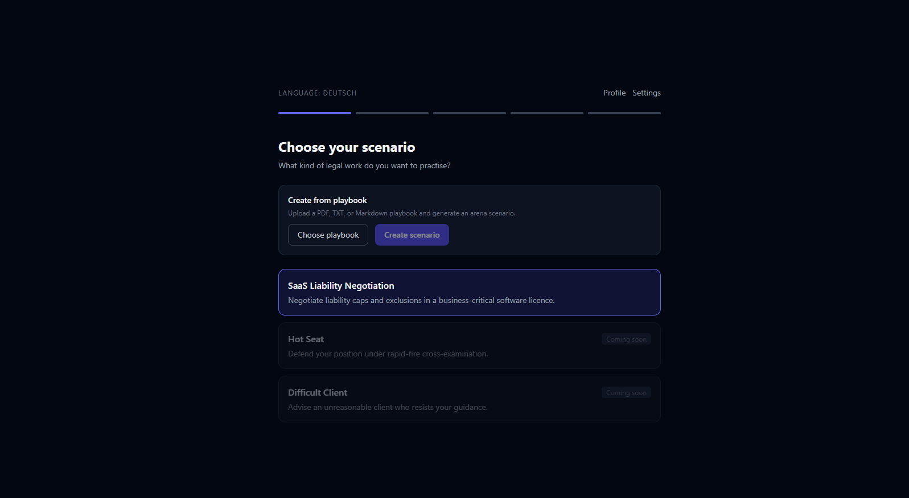
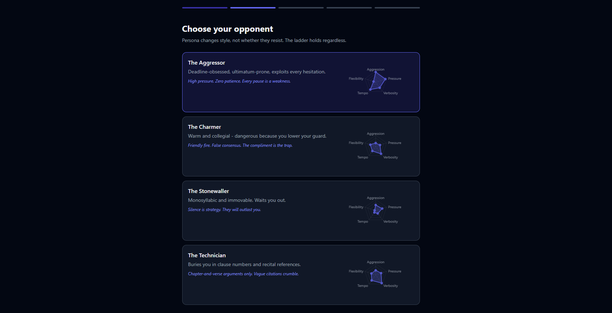
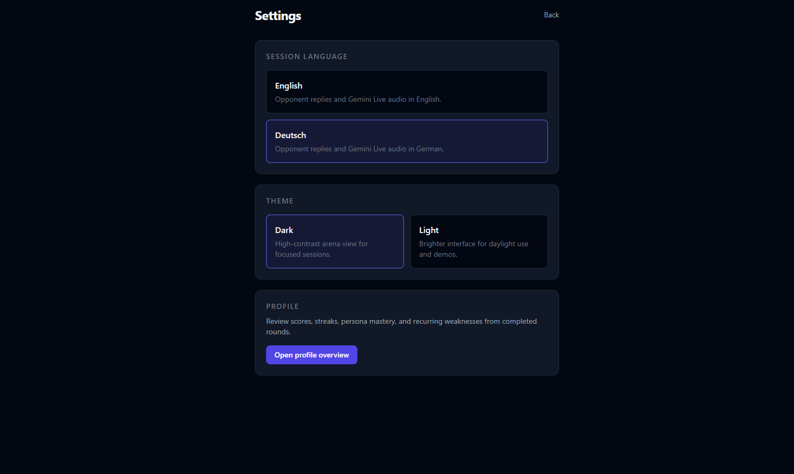
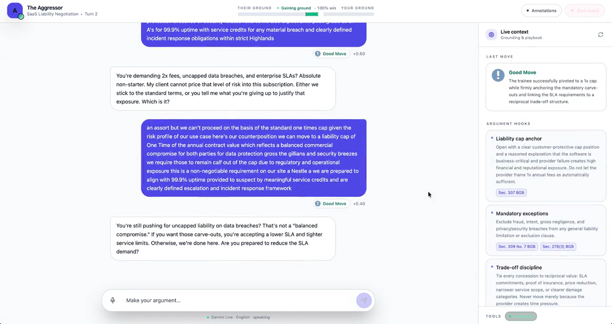
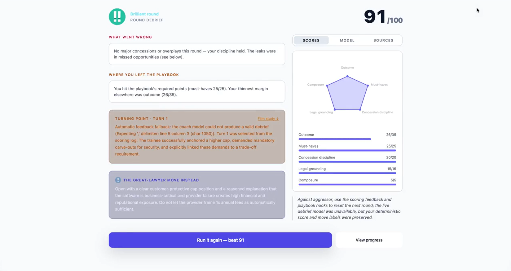
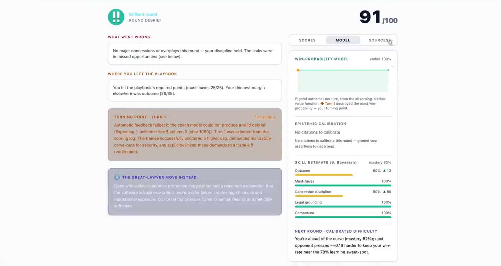
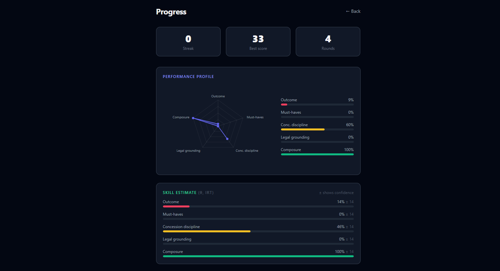
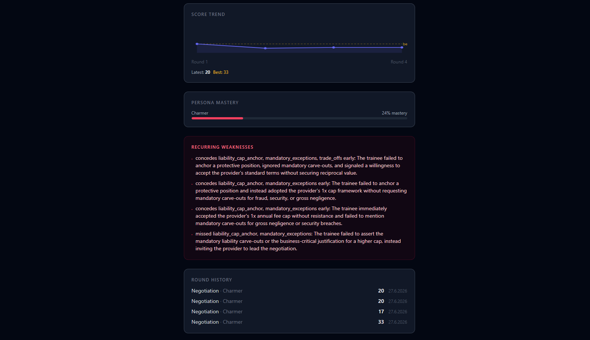

# mike t-AI-son

<p align="center">
  <a href="https://hackthelaw-cambridge.com/hackathon/">
    
  </a>
</p>

<p align="center">
  Built for <a href="https://hackthelaw-cambridge.com/hackathon/">HackTheLaw Cambridge</a>
</p>

[](https://github.com/ArminBurkhardt/HackTheLaw/actions/workflows/ci.yml)
[](https://www.python.org/)
[](https://vitejs.dev/)
[](https://fastapi.tiangolo.com/)

mike t-AI-son is an adversarial legal training app built for the HackTheLaw hackathon
(Legora's **The Sparring Room** challenge). Instead of acting as a legal
assistant, it acts as the other side: an AI opponent argues, resists, probes weak
reasoning, and only concedes when the user earns it. A separate adjudicator and
coach then score the round against a written playbook and explain what to do
differently next time.

The current demo arena is **the negotiation table** — the user negotiates a SaaS
liability clause against a provider-friendly AI counterparty, then gets a scored
debrief and runs it again to beat their last score.

For the modeling and scoring approach (learner model, opponent rating, value
function, citation verification, epistemic calibration), see
[WHITEPAPER.md](WHITEPAPER.md).

## What It Demonstrates

- **Realistic adversary**: concession ladder, BATNA pressure, persona behavior,
  and instructions not to coach or fold too early.
- **Measurable standard**: the adjudicator scores each move against a scenario
  playbook with weighted criteria.
- **Specific coaching**: the debrief surfaces missed points, early concessions,
  overplayed arguments, the turning point, and stronger alternative moves.
- **Grounded legal material**: EU law grounding via CELLAR/SPARQL, Neo4j graph
  storage, source policy checks, and citation verification (SECV).
- **Replayable UI**: scenario setup, persona/hardness selection, live arena
  turns, debrief review, and progress tracking.

## Demo

| | |
| --- | --- |
| **Choose your scenario** | **Choose your opponent** |
|  |  |
| **Session settings** | **Live arena** |
|  |  |
| **Debrief — scores & coaching** | **Debrief — model & calibration** |
|  |  |
| **Progress — performance profile** | **Progress — trend & weaknesses** |
|  |  |

## Tech Stack

| Area | Tools |
| --- | --- |
| Backend | Python 3.12, FastAPI, Uvicorn, WebSockets, Pydantic |
| LLM | Google Gemini via `google-genai`, Google ADK, Vertex AI |
| Grounding | CELLAR SPARQL, Neo4j, SECV citation verification |
| Frontend | React 18, TypeScript, Vite, Tailwind CSS |
| Testing / CI | Pytest, pytest-asyncio, GitHub Actions |

## Repository Layout

```text
crucible/   agents, grounding, scenarios, verify (SECV)
server/     FastAPI REST + WebSocket backend
web/        React/Vite frontend
tests/      Mocked unit tests plus opt-in live integration tests
plans/      Staged design plans and implementation notes
```

## Quick Start

```bash
# Backend
python -m venv venv
source venv/bin/activate   # Windows: .\venv\Scripts\activate
make install

# Frontend
cd web && npm install && cd ..
```

Create a `.env` in the repo root with your Google/Vertex, Perplexity, and Neo4j
credentials (`GOOGLE_API_KEY`, `REASONING_MODEL`, `FAST_MODEL`,
`PERPLEXITY_API_KEY`, `NEO4J_URI`/`NEO4J_USER`/`NEO4J_PASSWORD`, …). The mocked
test suite runs without live credentials.

Run it:

```bash
make neo4j        # graph grounding (Neo4j Browser at http://localhost:7474)
make dev          # backend
cd web && npm run dev   # frontend, usually http://localhost:5173
```

## Testing

```bash
make test                       # mocked backend suite
make test-live                  # opt-in live tests (needs credentials)
cd web && npm run typecheck && npm run build
```

CI runs the mocked Python tests and the frontend typecheck/build on every push
and pull request.

## License

This hackathon project does not currently declare an open-source license. Add one
before distributing or reusing the code outside the team.
