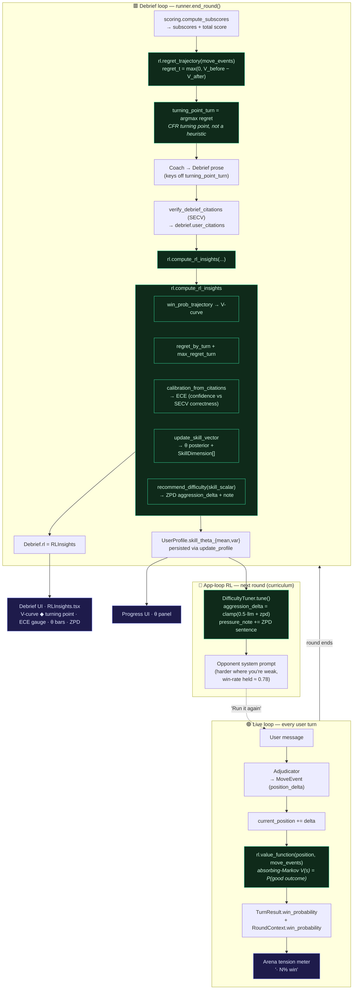
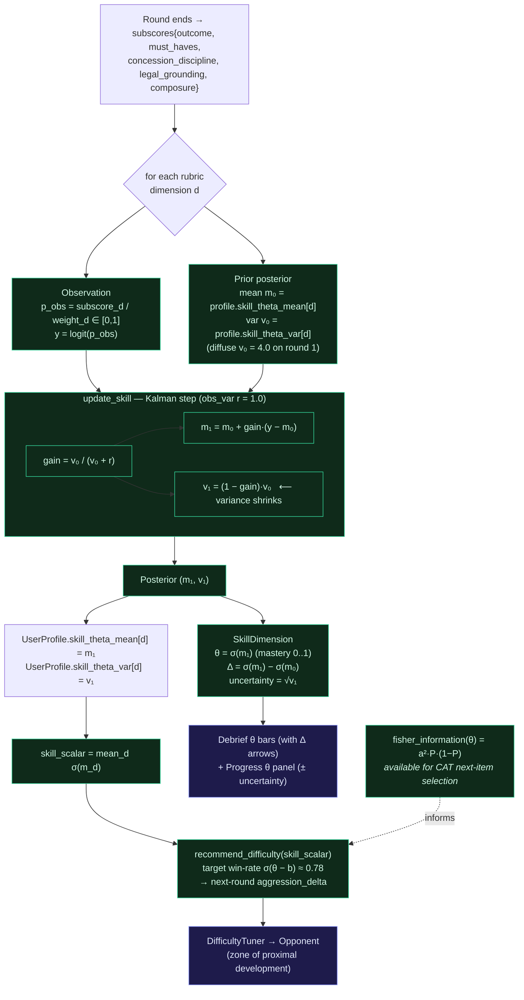

# RL Flow — where the grounded estimators run

Implements `THEORY_ADDENDUM.md`. All math is pure/deterministic in [`crucible/rl.py`](../crucible/rl.py);
it is wired into the round lifecycle by [`crucible/runner.py`](../crucible/runner.py) and surfaced in the UI.

## 1. End-to-end flow of the RL model

Two loops run around a round: the **live loop** (a value readout every turn) and the
**debrief loop** (the full estimator bundle + the app-loop curriculum update).

**Reading it:** green nodes are the pure `rl.py` estimators; indigo nodes are UI surfaces.
The live loop only computes `V(s)` (cheap, per turn). The expensive bundle runs once at debrief,
*after* SECV so calibration can read verified citations. The app-loop closes the ring: the
updated skill posterior θ drives the next opponent's difficulty.

---

## 2. The (θ, Bayesian) skill update — IRT detail

One Gaussian (Kalman) step per rubric dimension, in logit space. Variance shrinks every round,
so the estimate gets more confident as evidence accumulates. This is the engine behind the
Progress θ panel and the ZPD curriculum.

**Why Bayesian, not just an average:** the posterior carries *uncertainty* (`v`), so early rounds
move θ a lot and later rounds barely nudge it — and the ZPD matchmaker can be cautious when it's
still unsure. `fisher_information` is the principled "which item teaches most next" signal (CAT);
it's implemented and ready, currently feeding the difficulty heuristic rather than full item selection.
